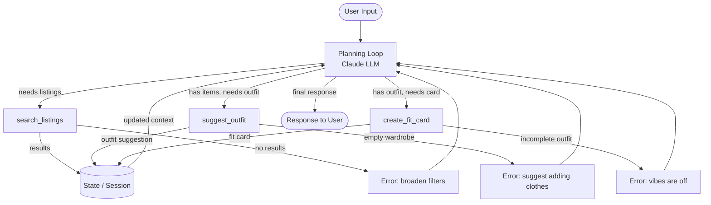

# FitFindr — planning.md

> Complete this document before writing any implementation code.
> Your spec and agent diagram are what you'll use to direct AI tools (Claude, Copilot, etc.) to generate your implementation — the more specific they are, the more useful the generated code will be.
> Your planning.md will be reviewed as part of your submission.
> Update it before starting any stretch features.

---

## Tools

List every tool your agent will use. For each tool, fill in all four fields.
You must have at least 3 tools. The three required tools are listed — add any additional tools below them.

### Tool 1: search_listings

**What it does:**
<!-- Describe what this tool does in 1–2 sentences -->
     This tool retrieves all the available items in our stored dataset and then filters out the specific items we need that matches its search parameters.
**Input parameters:**
<!-- List each parameter, its type, and what it represents -->
- `description` (str): This is a short quote that summarizes the kind of clothing item, we're looking for
- `size` (str): The actual clothing size.
- `max_price` (float): The maximum cost that the item has.

**What it returns:**
<!-- Describe the return value — what fields does a result contain? -->
It returns a list of dicts. Each dict is an entry for a clothing item that matches all the input parameters.

**What happens if it fails or returns nothing:**
<!-- What should the agent do if no listings match? -->
It should return an empty list, and then the agent can determine that there is no viable clothing item that matches the user's search input.

---

### Tool 2: suggest_outfit

**What it does:**
<!-- Describe what this tool does in 1–2 sentences -->
Given a selected item, and an existing list of already existing clothing items, the tool suggests appropriate matchings that would create a complete outfit.

**Input parameters:**
<!-- List each parameter, its type, and what it represents -->
- `new_item` (dict): The clothing item that we just retrieved
- `wardrobe` (dict): The list of items that are available to match with the new item.

**What it returns:**
<!-- Describe the return value -->
A string denoting the LLM's instructions on how to pair the new item with their existing wardrobe.

**What happens if it fails or returns nothing:**
<!-- What should the agent do if the wardrobe is empty or no outfit can be suggested? -->
If the wardrobe is empty, give out general advice based on the new item.

---

### Tool 3: create_fit_card

**What it does:**
<!-- Describe what this tool does in 1–2 sentences -->
This tool gives a caption describing the fit choice in a human-appreciable way.

**Input parameters:**
<!-- List each parameter, its type, and what it represents -->
- `outfit` (str): The returned output from the suggest_outfit tool
- `new_item` (dict): The thrifted item.

**What it returns:**
<!-- Describe the return value -->
A string denoting the outfit in trendy terms, and satisfying some given style guidelines.

**What happens if it fails or returns nothing:**
<!-- What should the agent do if the outfit data is incomplete? -->
Give some general spiel about the beauty of all outfits
---

### Additional Tools (if any)

<!-- Copy the block above for any tools beyond the required three -->
N/A
---

## Planning Loop

**How does your agent decide which tool to call next?**
<!-- Describe the logic your planning loop uses. What does it look at? What conditions change its behavior? How does it know when it's done? -->
After `search_listings` runs, check the results:
- If empty, exit early and return an error message.
- If not, return the first item in the list of results as the `new item`, and then pipe the output to `suggest_outfit`

After `suggest_outfit` runs, return a message that immediately hints at our success or failure:
- If a failure message is returned, then gracefully stop the agent loop with some message that suggests that the user may need to thrift a new item, upgrade their wardobe, or just wear what they like because beauty is different for everyone.
- If a successful message is returned, then the message should contain up to 3 good outfit suggestions, that can be acted upon by our user, or be processed again in `create_fit_card`

If `create_fit_card` is run, then there is unlikely to be a failure message, but just to be sure, there should be a failure and success state:
- For a failure state, give a very vague message on how outfits are in the beauty in the beholder.
- For a success state, (which should be more common), return an outfit summary in accordance with the style guides, that have been suggested in the docstring of the method's implementation.

---

## State Management

**How does information from one tool get passed to the next?**
<!-- Describe how your agent stores and accesses state within a session. What data is tracked? How is it passed between tool calls? -->
The state management can be as simple as a dictionary called state, that tracks:
- Conversation history,
- The last user message,
- The current item,
- The current outfit suggestion,
- The fit card,
---

## Error Handling

For each tool, describe the specific failure mode you're handling and what the agent does in response.

| Tool | Failure mode | Agent response |
|------|-------------|----------------|
| search_listings | No results match the query | Suggest adding more clothes, or modifying their search |
| suggest_outfit | Wardrobe is empty | Suggest adding more clothes, or modifying their search  |
| create_fit_card | Outfit input is missing or incomplete | The vibes are off |

---

## Architecture



---

## AI Tool Plan

<!-- For each part of the implementation below, describe:
     - Which AI tool you plan to use (Claude, Copilot, ChatGPT, etc.)
     - What you'll give it as input (which sections of this planning.md, your agent diagram)
     - What you expect it to produce
     - How you'll verify the output matches your spec before moving on

     "I'll use AI to help me code" is not a plan.
     "I'll give Claude my Tool 1 spec (inputs, return value, failure mode) and ask it to implement
     search_listings() using load_listings() from the data loader — then test it against 3 queries
     before trusting it" is a plan. -->

**Milestone 3 — Individual tool implementations:**

**Tool 1: `search_listings(description, size, max_price)`**
- **AI tool:** Claude (claude-sonnet-4-6 via Claude Code)
- **Input:** The Tool 1 spec from planning.md (inputs, return value, failure mode), the `search_listings` docstring and TODO steps from tools.py, and the `load_listings()` data loader signature
- **Expected output:** A working implementation that loads listings, filters by price and size, scores by keyword overlap with `description`, drops zero-score items, and returns sorted results
- **Verification:** Run three manual test calls — (1) a broad query with no filters that returns multiple results, (2) a size + price filter that narrows results, (3) a query with no matching keywords that returns an empty list. Confirm return type is `list[dict]` and each dict has the expected fields

**Tool 2: `suggest_outfit(new_item, wardrobe)`**
- **AI tool:** Claude (claude-sonnet-4-6 via Claude Code)
- **Input:** The Tool 2 spec from planning.md, the `suggest_outfit` docstring and TODO steps from tools.py, and the Groq client helper `_get_groq_client()`
- **Expected output:** An implementation that branches on empty vs. non-empty wardrobe, builds an appropriate prompt in each case, calls the Groq LLM, and returns the response string
- **Verification:** Call with an empty wardrobe and confirm a non-empty general styling suggestion is returned (not an exception). Call with a populated wardrobe dict and confirm the response references specific named wardrobe pieces. Confirm return type is `str` in both cases

**Tool 3: `create_fit_card(outfit, new_item)`**
- **AI tool:** Claude (claude-sonnet-4-6 via Claude Code)
- **Input:** The Tool 3 spec from planning.md, the `create_fit_card` docstring and TODO steps, the caption style requirements (casual, mentions item/price/platform once, higher temperature)
- **Expected output:** An implementation that guards against empty `outfit`, builds a caption prompt with item details, calls the LLM at higher temperature, and returns a 2–4 sentence caption string
- **Verification:** Call with a real outfit string and listing dict and confirm output is 2–4 sentences, reads like an OOTD post, and mentions the item name, price, and platform. Call with an empty `outfit` string and confirm an error message string is returned instead of an exception

**Milestone 4 — Planning loop and state management:**

- **AI tool:** Claude (claude-sonnet-4-6 via Claude Code)
- **Input:** The Architecture diagram from planning.md, the three completed tool implementations from tools.py, the agent loop skeleton in agent.py, and the session/state schema
- **Expected output:** A planning loop that accepts user input, decides which tools to call and in what order, passes state between tool calls, handles error returns gracefully, and returns a final natural-language response
- **Verification:** Run the full example query from "A Complete Interaction" end-to-end and confirm all three tools are invoked in sequence, state flows correctly between them (listing → outfit → fit card), and the final response includes both outfit suggestions and a caption

---

## A Complete Interaction (Step by Step)

Write out what a full user interaction looks like from start to finish — tool call by tool call. Use a specific example query.

**Example user query:** "I'm looking for a vintage graphic tee under $30. I mostly wear baggy jeans and chunky sneakers. What's out there and how would I style it?"

**Step 1: Parse the query**
`_parse_query()` sends the raw query to the LLM and extracts structured parameters:
- `description`: `"vintage graphic tee"`
- `size`: `null` (none mentioned)
- `max_price`: `30.0`

These are stored in `session["parsed"]`.

**Step 2: Search for listings**
`search_listings("vintage graphic tee", size=None, max_price=30.0)` is called.
All listings are loaded, filtered to `price ≤ $30`, then scored by keyword overlap against `"vintage graphic tee"`. Items with score 0 are dropped. Results are returned sorted by score — e.g. top result might be `"Vintage Band Tee — Faded Black, $18, depop"`.

The list is stored in `session["search_results"]`. Since results exist, the agent does not exit early.

**Step 3: Select the item**
The first (highest-scoring) result is chosen as `session["selected_item"]` — e.g. the faded black band tee at $18.

**Step 4: Suggest an outfit**
`suggest_outfit(selected_item, wardrobe)` is called with the band tee and the user's example wardrobe (which includes baggy jeans, chunky sneakers, etc.).
The LLM receives a prompt listing the new item's details and every wardrobe piece by name and color, then returns 1–2 specific outfit combos referencing named pieces — e.g. *"Pair the band tee with the baggy straight-leg dark wash jeans and chunky white sneakers for a 90s grunge look."*

The suggestion string is stored in `session["outfit_suggestion"]`.

**Step 5: Generate the fit card**
`create_fit_card(outfit_suggestion, selected_item)` is called.
The LLM receives the outfit description plus the item's title, price, and platform, and writes a 2–4 sentence OOTD caption — e.g. *"Found this faded band tee for $18 on depop and I'm not looking back. Threw it on with baggy dark wash jeans and chunky sneakers and it's giving effortless 90s energy all day."*

The caption is stored in `session["fit_card"]`.

**Final output to user:**
The Gradio UI populates three panels:
- **Top listing found:** Title, price ($18), size, condition, platform (depop), colors, style tags, and item description
- **Outfit idea:** The 1–2 outfit suggestions from `suggest_outfit`, naming specific wardrobe pieces to pair with the tee
- **Your fit card:** The casual 2–4 sentence OOTD caption from `create_fit_card`, ready to copy and post


### Failure Scripts

```
python -c "from tools import search_listings; print(search_listings('designer ballgown', size='XXS', max_price=5))"
```

```
python -c "
from tools import search_listings, suggest_outfit
from utils.data_loader import get_example_wardrobe, get_empty_wardrobe
results = search_listings('vintage graphic tee', size=None, max_price=50)
print(suggest_outfit(results[0], get_empty_wardrobe()))
"
```

```
python -c "
from tools import search_listings, create_fit_card
results = search_listings('vintage graphic tee', size=None, max_price=50)
print(create_fit_card('', results[0]))
"
```